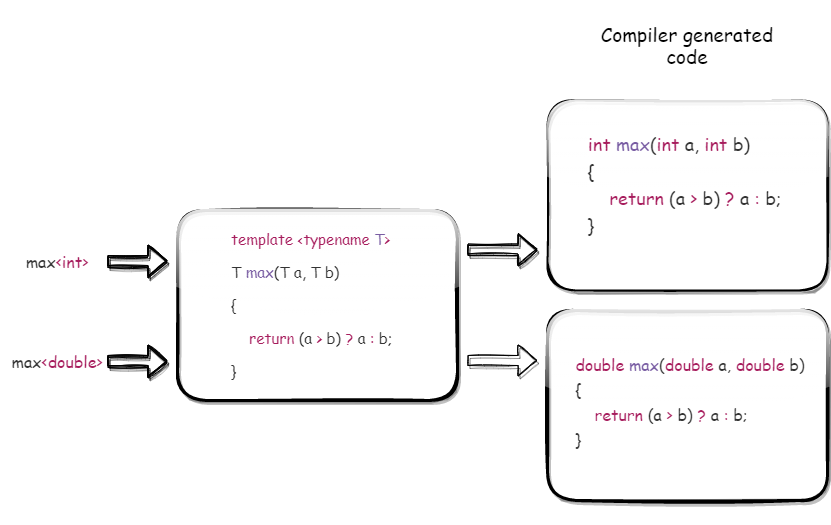

# Introduction to C++ Templates

 [Generic programming](https://en.wikipedia.org/wiki/Generic_programming) has become a dominant programming pattern in C++, especially after the inclusion of the Standard Template Library (STL) as a part of the standard library. Templates are the feature that supports generic programming in C++, which are compile time mechanism and there is no runtime overhead associated with using them. C++ templates are a strong technique for code reuse, they allow the programmer to design code that acts consistently for data of any type.

 > **_NOTE:_**  Like the [structured](https://en.wikipedia.org/wiki/Structured_programming), [modular](https://en.wikipedia.org/wiki/Modular_programming) and [object oriented](https://en.wikipedia.org/wiki/Object-oriented_programming) approaches, generic programming is another programming approach and C++ supports all the four programming patterns.

 In simple words, templates allow functions and classes to work on different data types without having to rewrite the entire code. We just need to pass the data type as a parameter (explicitly or implicitly); this parameter which passes the data type is known as **typename**.

 ### Motivation 
 With a [strongly-typed](https://en.wikipedia.org/wiki/Strong_and_weak_typing) language we may find ourselves having to implement a different version of a common function for each type:

 ```C++
 int max(int a, int b)
 {
     return (a > b) ? a : b;
 }

 double max(double a, double b)
 {
     return (a > b) ? a : b;
 }
 ```
This can be time-consuming, tiresome, and error-prone (especially if there is a common bug). The actual code written for both functions is identical in each case; it is just the type of the variable value that changes, yet we have to duplicate the function for each distinct type.

The preprocessor offers one way to avoid such redundant implementations:

```C++
#define max(a, b) ((a) > (b) ? (a) : (b))
```
Since Macros are a dumb and simply a text substitution mechanism; they have no idea of scope and types, which might result in a strange semantic errors. Using templates could elegantly solve this problem; using _function templates_ (I will talk more about this later), it is enough to write generic code for one solution:

```C++
template <typename T>
T max(T a, T b)
{
    return (a > b) ? a : b;
}
```
This saves us from lots of programming effort and can be helpful in variety of programming tasks. The three important advantages of using templates are:
 - reusability - writing code for one generic type is enough
 - type safety - strict type checking done at the compile time
 - performance - as templates involve no runtime overhead 

 > **_NOTE_:** In mid 90's the templates are started with the desire to *parameterize* the containers.

 ### Using templates
 We can declare a template with the keyword template.

```C++
template<typename T>
template<class T>
```
The keyword `template` always begins a definition and declaration of a function template and class template. The `<>` brackets contain a list of template parameters.

> **_NOTE:_** In the expression `template<typename T> void get(T a) { };`, `T` is parameter and when the function is called as `get(10);` `10` is a template argument with type `int`.

The keyword `typename` (or `class`) tells the compiler that what follows is the name of a type. To use the template function you call it with the required type in angle-brackets (`<>`). 

```C++
max<int>(10, 20);
max<double>(10.11, 20.22);
```


##### Multiple template parameter
If differing types are required, then multiple type parameters can be specified.

```C++
template <typename RT, typename T1, typename T2>
RT max(T1 a, T2 b)
{
    return (a > b) ? a : b;
}

int main()
{
    double x;
    // note that return type cannot be deduced, so must always be specified
    x = max<double, double, int>(23.9, 45);  // double max<double, int>
    x = max<double>(15, 11.5);               // double max<int, double>
    x = max<double>(15.5, 11);               // double max<double, int>

    return EXIT_SUCCESS;
}
```

Note that it is programmer responsible to specify the return type explicitly to achieve required behavior. We can also use `decltype` to deduce the return type from the function.

```C++
template<typename T1, typename T2>
auto max(T1 a, T2 b) -> decltype((a > b) ? a : b)
{
    return (a > b) ? a : b;
}
```

> **_NOTE:_** It is important to note that to evaluate the expressions inside the `decltype`, the variable `a` and `b` should be visible to evaluate the expression. Using `decltype` in place `auto` in above code leads to compiler error.

The concept of templates can be used in two different ways:
- As a function template
- As a class template

#### Function template

Templates enable the creation of generic functions that accept any data type as parameters and return a result without the need to overload the function with all conceivable data types. The general form of a template function definition is shown here:

```C++
template<parameter_list>
ret_type func_name(argument_list)
{
    // body of function
}
```
A simple example can be the addition of two variables, for example, of the `int`, `float` or `double` types. The function requirement will be to return the summed value with the correct return type that is based on the type of the input variables. 

```C++
template <typename T>  
T add(T a, T b)          
{
    return a + b;
}
```
This example is a bit simplistic as the `+` operator does the same thing, but it is a good start.

#### Class template

Class Template can also be defined similarly to the Function Template. When a class uses the concept of Template, then the class is known as generic class. Like function templates, class templates are useful when a class defines something that is independent of the data type.

The general syntax for the class template is:

```C++
template <class T>
class class_name
{

   //.....

public:
    T memVar;
    T memFunction(T args);
};
```
In the above declaration, `T` is the template argument which is a placeholder for the data type used. Inside the class body, a member variable `memVar` and a member function `memFunction` are both of type `T`. Once a template class is defined as above, we can create class objects as follows:

```C++
class_name<int> classObejct1;
class_name<float> classObject2;
class_name<char> classObject3;
```
Let us look at an example that demonstrate Class Templates.

```C++
template <class T>
class MyClass
{
    T a, b;

public:
    MyClass(T first, T second)
    {
        a = first;
        b = second;
    }
    T getMaxval();
};

template <class T>
T MyClass<T>::getMaxval()
{
    return (a > b) ? a : b;
}

int main()
{
    MyClass<int> Obj1(50, 150);
    std::cout << "Maximum of 50 and 150 = " << Obj1.getMaxval() << std::endl;

    MyClass<char> Obj2('A', 'a');
    std::cout << "Maximum of 'A' and 'a' = " << Obj2.getMaxval() << std::endl;

    return 0;
}

/*OUTPUT
Maximum of 50 and 150 = 150
Maximum of 'A' and 'a' = a
*/
```
The above program implements an example of a class template. We have the template class `MyClass`. Inside this, we have a constructor that will initialize the two members `a` and `b` of the class. There is another member function `getMaxval` which is also a function template that returns a maximum of `a` and `b`.

### Defining Templates

Templates can have one or more template parameters, which can be

- Type parameter
- Non-type parameters
- Template template parameters

#### Type parameter
Template Type Parameters are template parameters that refer to a type; they are the most common form of template parameters. The simple syntax is:

```C++
typename type
```
or
```C++
class type
```
Once `type` has been introduced in the template parameter list, then any reference to name with in the body of the template automatically refers to the type of the corresponding template argument for each instantiation, and can be used anywhere a type can normally be used.

```C++
template<typename T>
T compare(T l, T r)
{
    return (l > r) ? 1 : 0;
}

template<class T>
class Container
{
public:
    void put(T* p);
    T* get();
    // other members
};
```

#### Non-type parameter

Non-Type Template Parameters are template parameters that are **values** rather than types. They can be any value that is a compile-time constant.

```C++
template<int N>; 	// N is a constant expression determined at compile time
template<size_t N, size_t M>;	// N, M is a constant expression determined at compile time
```

Let us look at an example that uses Non-type parameter

```C++
//int size is a non-type parameter
template <class T, int size>
class MyType
{
    T a[size];

public:
    MyType()
    {
        for (int i = 0; i < size; i++)
            a[i] = i;
    }
    T &operator[](int i)
    {

        if (i < 0 || i > size - 1)
        {
            std::cout << "Index value of " << i << " is out-of-bounds.\n";
            exit(1);
        }
        return a[i];
    }
};


template<typename T, size_t n>
void printValues(T (&arr)[n])
{
    for(size_t i = 0; i < n; ++i)
    { 
        std::cout << arr[i] << ' ';
    } 
    std::cout << std::endl;
}
```

class `MyType` has non-type template parameter which is an integer (`int size`) with type parameter (`class T`) in the template parameter list.

#### Default Template Parameters

Template parameters can have their default values; all template parameters with a default value have to be declared at the end of the template parameter list. The basic idea is that the template parameters with default value can be omitted while template instantiation.

Simple example of default template parameter value usage:

```C++
template <class T, size_t N = 10>
struct my_array
{
    T arr[N];
};

int main()
{
    /* Default parameter is ignored, N = 5 */
    my_array<int, 5> a;

    /* Print the length of a.arr: 5 */
    std::cout << sizeof(a.arr) / sizeof(int) << std::endl;

    /* Last parameter is omitted, N = 10 */
    my_array<int> b;

    /* Print the length of a.arr: 10 */
    std::cout << sizeof(b.arr) / sizeof(int) << std::endl;
}

/*OUTPUT
5
10
*/
```
Similarly, the type parameter can also have a default type

```C++
template<class T=int>
struct MyClass
{
  void myMember(T* vec) {
    // ...
  }
};

MyClass obj; // is equivalent to MyClass<int> obj
MyClass<char> obj; // is equivalent to MyClass<char> obj
```
### Template Specialization 

While programming using templates, we might be faced with a situation such that we might require a special implementation for a particular data type. When such a situation occurs, we go for template specialization.

Template specialization comes in two forms: 
- **Explicit specialization** (aka Full specialization) - where a unique version of the template is defined for a specific type.
- **Partial specialization** - where a template is defined that acts on a qualified range of types.

#### Explicit specialization

It is also possible to explicitly specialize a template function. An explicitly specialized template function is when the function is declared for a specific type.

```C++

// This template function doesn't give correct result for char *
template <typename T>
T* max(T* a, T* b)
{
    return (*a > *b) ? a : b;
}

// Explicit specialization of max function for const char *
template<>
const char* max(const char* a, const char* b)
{
    return strcmp(a, b) > 0 ? a : b;
}
```

Now, lets look at an example for full specialization of template class.

```C++

/**
 * The below template class doesn't give correct result for below piece of code
 * FindMax<const char*> Max
 * const char* str1 = "Good"
 * const char* str2 -= "Bye"
 * const char * res = Max.getMax(str1, str2);
 */
template<typename T>
class FindMax
{
public:
    T getMax(T a, T b)
    {
        return (a > b)? a : b;
    }
};

// Hence, explicitly specialized class defined for const char *
template<>
class FindMax<const char*>
{
public:
    const char* getMax(const char* a, const char* b)
    {
        return (strcmp(a,b) > 0)? a : b;
    }
};
```

#### Partial specialization

When you write a template specialization that involves some, but not all, of the template parameters, it is called partial specialization. Compilers that support partial specialization allow the programmer to specialize some parameters while leaving the others generic. 

Below is an example that demonstrate the code for partial specialization.

```C++
template <class T1, class T2>
class MyClass
{
public:
    MyClass()
    {
        std::cout << "MyClass<T1, T2>::MyClass() --> regular constructor\n";
    }
    T1 _a;
    T2 _b;
};

// Partial specialization class to int as second template parameter
template <class T>
class MyClass<T, int>
{
public:
    MyClass()
    {
        std::cout << "MyClass<T, int>::MyClass() --> partial specializations\n";
    }

    T _a;
    int _b;
};

int main()
{
    MyClass<double, double> a;
    MyClass<double, int> b; // partial specialization
    return 0;
}

/*OUTPUT
MyClass<T1, T2>::MyClass() --> regular constructor
MyClass<T, int>::MyClass() --> partial specializations
*/
```
The partial specialization of the class template `MyClass<T, int>` looks a bit like a normal template definition and a bit like an explicit specialization. The compiler knows it is a partial specialization, as a result the second declaration of the `MyClass` invokes the partial specialized class during instantiation.

In this article, I tried to give some insight into how templates work and how they can be utilized to make the task of writing and maintaining software easier. Templates provide immense scope on writing a generic functions and classes, which is an essential C++ feature without which C++ STL couldn't exist.
